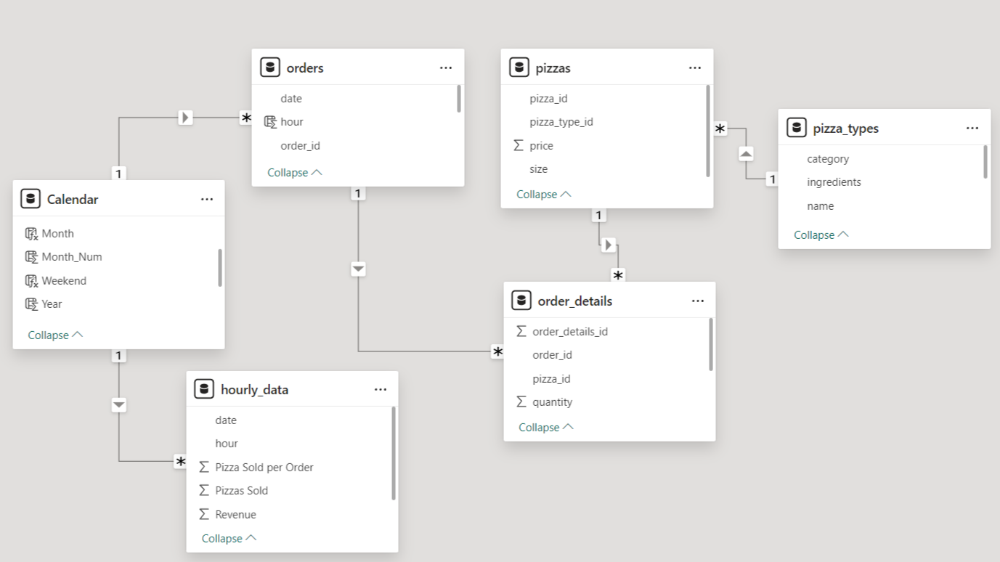

# Pizza-Operations-Analysis

# Project Overview
The project provides insights and recommendations to improve the operations of a fictional pizza restaurant by analyzing **daily and hourly order volume**, **utilization of seating capacity**, **performance of menu items**, and **inventory** of over 48,000 rows of transaction data through data modeling and visualization in **Power BI** 

Dataset Source: [Pizza Place Sales on Maven Analytics](https://mavenanalytics.io/data-playground)

Project Link: [Project Page on Maven Analytics](https://mavenanalytics.io/project/17806)

Tools Used: #Power-BI #Python 

Data Analysis Skills: #Data-Transformation #Data-Modeling #Exploratory-Data-Analysis #Data-Visualization #Time-Series-Analysis #Operations-Analysis

Source Files:
* [Link to Power BI report](./Pizza%20Restaurant%20Operations%20Report.pbix)
* [Link to data transformation Python Script](./get_unique_ingredients.py)

# Table of Contents
* [Project Background](#project-background)
* [Objectives](#objectives)
* [About The Data]()]
* [Data Modeling](#data-modeling) 
* [Data Analysis](#data-analysis)
* [Key Insights and Recommendations](#key-insights-and-recommendations)

# Project Background
The project assumes the role of a data analyst for a pizza place aiming to use the restaurant data to improve operations efficiency.

# Objectives
The project aims to answer the following questions:
- When are the busiest days and times?
- How many pizzas are being made during peak hours?
- What are the best and worst selling pizzas?
- How well is the seating capacity being utilized?

# About The Data
The dataset contains 48,620 rows of transaction data collected for one year.
The dataset contains four tables
- `order_details` - fact table containing data of all the pizzas ordered for each order ID.
- `orders` - contains the date and time for each order ID.
- `pizzas` - contains pizza type, size, and price of each pizza.
- `pizza_types` - contains name, category, and list of ingredients for each pizza type.

The provided dataset is clean and ready for modeling and analysis.

# Data Modeling
## Data Transformation of Ingredients List
The number of unique ingredients of each pizza type was calculated from the ingredients list of the `pizza_types` using a Python script wih the following transformations:
1. Created a matrix of ingredients vs. pizza type using `.explode()` and `pandas.get_dummies()` methods.
2. Extracted list of unique ingredients by counting the number of pizza types that uses each ingredient.
3. Calculated the number of unique ingredients each pizza type uses.

## Date Table
- A calendar table using the date range of the `orders` table was created.
- The following calculated columns were created: Year, Month, Day, Day of Week, Month Number, Day of Week Number, Weekday/Weekend
- Sorted Month by Month Number and Day of Week by Day of Week Number
- Created date hierarchy: Year -> Month -> Day
- Marked as Data Table

## Calculated Columns
`pizza_types`
- Pizzas sold by type
`orders`
- Number of pizzas sold by order ID
	- Grouped into 1, 2, 3, 4, and 5+
- Hour from time data
	- Created group for peak hours

## Measures
`order_details`
- Pizzas sold - sum of quantities of pizzas ordered
- Average Pizzas Sold per Day - Calculated the average of total pizzas sold grouped by date.
- Revenue
`orders`
- Average Orders per Day - Calculated the average of total orders grouped by date.
`pizza_types`
- Popularity rank by number of pizzas sold

## Hourly Data Calculated Table
This table is used to quickly visualize the relationship between total orders and pizzas sold per order during peak hours.
- Grouped by date and hour
- Summarizations: total orders, total pizzas sold, pizzas sold per order, revenue

## Table Relationships
- `pizza_types` filters `pizzas`,:one-to-many
- `pizzas` and `orders` filter `order_details`: one-to-many
- Date table filters `hourly_data` and `orders`: one-to-many

Below is an image of the resulting data model.

# Data Analysis
## Order Volume Analysis
The following charts were created for the analysis:
- Column chart to visualize number of daily average number of pizzas sold by hour.
	- Peak hours is between 12 PM and  2 PM.
- Matrix formatted as a heat map to visualize average pizzas sold by hour and day of week
	- Highest pizzas sold on weekdays at lunch.
	- Weekends tend to have more customers in the evening.
	- Very few pizzas sold during 9 to 11 AM and 11 PM onwards.

## Seating Capacity Analysis
The following charts were created for the analysis:
- Histogram of total order count by pizzas sold per order, filtered to include only peak hours.
	- Majority of customer only order 1 to 2 pizzas.
- Scatter plot of average pizzas sold per order by total order
	- On hours where total orders reach or exceed seating capacity, average pizzas sold is only between 2 and 3.

## Pizza and Ingredients Analysis
The following tables were created for the analysis:
- Top 3 best selling pizzas
- Worst selling pizza
- Top5 pizzas with most number of unique ingredients

Below is a screenshot of the report with the above mentioned charts.

# Key Insights and Recommendations
## Order Volume Analysis
**Key Insights:** The busiest hours are on **weekdays at 12-2 PM, and evenings at 6 PM**, accounting for **37.5%** of all pizzas sold. The least busy hours are at **9-11 AM, and at 11 PM,** accounting for only **0.2%** of pizzas sold.

**Discussion:** The three lowest hours sold only contributed 0.2% of the total pizzas sold, but accounts for 20% of the operating hours. While no data on operational costs was available, it is very unlikely that the very low sales will be able to offset the operational costs (utilities and labor) during these hours.

**Recommendations:** Increase staff during peak hours and consider shortening store hours to 11AM - 11PM to reduce operational costs.

## Seating Capacity Analysis
**Key Insights:** 68.5% of orders have only 1-2 guests. The average pizzas ordered per table during hours where number or orders reached or exceeded maximum capacity is less than 3, suggesting majority of tables are only occupied by at most two customers.

**Discussion:** The pizzas sold per order during peak hours histogram provides a snapshot of how many customers occupy each table. Assuming the restaurant has a layout of 4 seats per table, the analysis reveals that majority of the time, at least two out of the four seats in the table were not occupied, and therefore not generating revenue. This is especially important during hours when the restaurant reaches or exceeds the table capacity as shown in the scatter plot where the average pizzas sold per order as below 3. This implies that on average, at least one seat is unoccupied. One possible way to improve operations is to put more tables and introduce tables with two seats. This will help make the unoccupied seats available to diners during peak hours, increasing revenue.

**Recommendations:** Reduce 4-seater tables and add 2-seater tables to maximize seating capacity. Consider discount promos on bundle of pizzas for even-numbered guests to better maximize seating capacity.

***Analysis assumes:*** *1 pizza per customer; 15 tables and 60 seats; 4 seats per table; each order is assigned to 1 table*

## Pizza and Ingredients Analysis
**Key Insights:** **The Barbecue Chicken pizza** is the best selling pizza while **The Thai Chicken Pizza** has the highest revenue. **The Brie Carre Pizza** is the worst selling pizza. **The Chicken Alfredo, The Chicken Pesto, and The Spinach Supreme** all have at least 3 unique ingredients - ingredients only used for that pizza type, but are some of the least popular pizzas.

**Discussion:** While having unique ingredients potentially adds novelty value to a menu item, it takes up space in the inventory. Ideally, perishable inventory like good ingredients should be sold and replaced as fast as possible. Unique ingredients used in pizzas that are not selling well not only are idly taking up space in the inventory, the quality of these ingredients will also deteriorate over time and may become inedible. Removing worse-selling pizzas with unique ingredients have two potential benefits: free up inventory space for ingredients that sell more and streamline the menu to only include pizzas that customers are more likely to order.

**Recommendations:** Consider removing The Brie Carre Pizza and the least popular pizzas with the most unique ingredients to reduce inventory. Also consider leveraging the most popular pizzas to pair with less popular entries as discount promos.